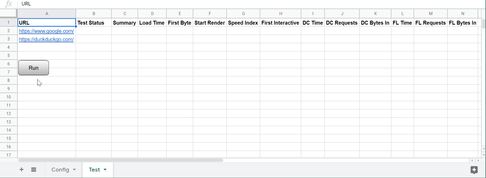

# Genjo

WebPageTest client running on Google Spreadsheet

## Example (fast-forwarded)

## How to setup

1. Copy [this Google spreadsheet document](https://docs.google.com/spreadsheets/d/1u0V6suVYJXSwyAoDRh8QQS6l8VtgN6ETCjNKWwU7CWk/edit#gid=763224153) to your account.
2. Open Config sheet, write your [WebPageTest API key](https://www.webpagetest.org/getkey.php).
3. Open Test sheet, edit URL list.

## How to run tests

1. Open Test sheet, click Run button.
2. Wait with your patience.
